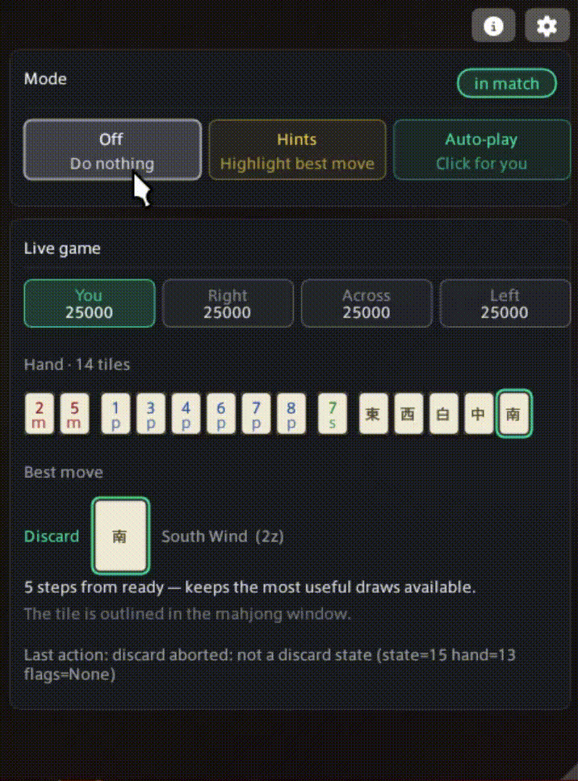

<p align="center">
  
</p>

<h1 align="center">Doman Mahjong Sensei</h1>

<p align="center">
  <a href="https://github.com/sweatpotato13/FFXIV-MahjongSensei/releases/latest"></a>
  <a href="https://github.com/sweatpotato13/FFXIV-MahjongSensei/releases"></a>
  <a href="https://github.com/sweatpotato13/FFXIV-MahjongSensei/actions/workflows/ci.yml"></a>
  <a href="LICENSE.md"></a>
</p>

<p align="center">
  <em>Doman Mahjong, solved for you. Built on Dalamud.</em>
</p>

---

## About this fork

A fork of [XeldarAlz/FFXIV-AutoMahjongSolver](https://github.com/XeldarAlz/FFXIV-AutoMahjongSolver).
Forked from upstream commit
[`21ae5ca9aa1fa3785baa540245b51efa346f9d37`](https://github.com/XeldarAlz/FFXIV-AutoMahjongSolver/commit/21ae5ca9aa1fa3785baa540245b51efa346f9d37)
(2026-07-20). This repository starts with a single initial commit containing the fork's modifications.

All credit for the plugin itself goes upstream. The fork started because upstream does not build
against Korean Dalamud and does not recognise Korean call prompts, but two of the four changes are
engine bugs that were wrong on every client, so this build is worth having on any region.

Changes against upstream:

- **Korean call prompts.** Pon, chi, kan, riichi, tsumo, ron and pass were matched against hardcoded
  English strings, so on a Korean client the plugin never saw a call being offered and passed on all
  of them. Discarding worked because it reads tile textures, not text. Labels now live in the layout
  profile as per-locale alias lists, so one build serves every language.
- **Shanten fix (all clients).** Holding all four copies of a tile made the calculator report a dead
  wait as tenpai, e.g. `5555788889999m`. Verified by exhaustive cross-check over all 93,600
  single-suit 13-tile hands: 745 were wrong before, none now.
- **Doman minimum is one han, not two (all clients).** The bot was refusing legal one-han wins such
  as riichi-only or menzen tsumo.
- **Builds against current Dalamud.** `AtkValueType.String8` is `[Obsolete]` in the FFXIVClientStructs
  that Dalamud 15.0.3.5 ships, and this repo treats warnings as errors.

Works on Korean and English clients. Japanese, German and French clients are untouched by this
fork: upstream only ever matched English call labels, so calls do not fire there either way. Adding
a locale is now a list of aliases in `data/layouts/*.json` rather than a code change, so send a
screenshot of a call prompt and it can go in.

Installed as `MahjongSensei`, a different plugin identity from upstream, so the two do not overwrite
each other. Settings are not carried over from an upstream install.

## Install

Dalamud settings &rarr; Experimental &rarr; Custom Plugin Repositories, add:

```
https://raw.githubusercontent.com/sweatpotato13/FFXIV-MahjongSensei/main/repo.json
```

Save, then find **Doman Mahjong Sensei** in the plugin installer. Updates arrive through
Dalamud from then on.

<p align="center">
  
</p>

## What it does

Sit at a mahjong table and a small window watches your hand, suggesting the best discard and why. Three modes:

- **Off**: plugin sleeps.
- **Hints**: shows the best discard + top alternatives with reasoning. You click every move. *100% safe.*
- **Auto-play**: plays for you with natural pacing.

## Features

- Three modes: Off / Hints / Auto-play, one click each.
- Hand, score, and discard-count readout from addon memory.
- Top-3 discard candidates with short reasoning.
- Full call handling: Pon · Chi · Kan · Riichi · Tsumo · Ron.
- Akadora-aware scoring; meld inference for chi/pon/minkan races.
- Adjustable "thinking" delay so auto-play looks human.
- Per-dispatch chat-log annotations make regressions a single log paste away.

## Install

In-game: `/xlsettings` → **Experimental** → paste into **Custom Plugin Repositories**:

```
https://raw.githubusercontent.com/sweatpotato13/FFXIV-MahjongSensei/main/repo.json
```

Tick **Enabled**, click **+**, then **Save and Close**. Open `/xlplugins` → **All Plugins**, search for **Doman Mahjong Solver**, and install.

## Commands

| Command | Action |
|---|---|
| `/mjauto` | Toggle the main window |
| `/mjauto pass <N>` | Click button index `<N>` on a call prompt (0 = leftmost) |
| `/mjauto capture <label>` | Capture the next dispatch payload to disk (debugging) |
| `/mjauto variant dump` | Dump client variant info (JP / OC verification) |

## Client compatibility

The mahjong addon ships under different names and memory layouts per region. EU is the reference variant; NA has the same texture base + offsets but hasn't been re-verified against v0.1.0.11. JP and OC need verification dumps.

| Feature | EU (`Emj`) | NA (`EmjL`) | JP | OC |
|---|---|---|---|---|
| Window detection | Yes | Yes | Untested | Untested |
| Hand / score reading | Yes | Needs re-verification ([#30](https://github.com/sweatpotato13/FFXIV-MahjongSensei/issues/30)) | Untested | Untested |
| Discard (state-30 in-hand) | Yes | Probably yes | Untested | Untested |
| Discard (state-6 self-declare popup) | Yes | Probably yes | Untested | Untested |
| Post-call discard popup | Yes | Probably yes | Untested | Untested |
| Pon / Chi / Kan acceptance | Yes | Likely yes ([#30](https://github.com/sweatpotato13/FFXIV-MahjongSensei/issues/30)) | Untested | Untested |
| Riichi / Tsumo / Ron commit | Yes (v0.1.0.11) | Untested | Untested | Untested |

If you're on JP or OC: seat at a Doman table, run `/mjauto variant dump`, and attach the file to a new issue.

## Troubleshooting

**Misclicked a call prompt?** Click the right option yourself in-game: the plugin resumes on the next turn. Or from chat: `/mjauto pass <N>`.

**Plugin stalled on a popup?** Switch to **Off**, click manually, then re-enable **Auto-play**. If you can reproduce, run `/mjauto capture <label>` first: the `FireCallback` payload lands in `pluginConfigs/Mahjong.Plugin.Dalamud/emj-captures.log` and is the fastest way to get a fix shipped.

Known edge cases that can stall the bot (manual click resumes play): post-MinKan transient, two consecutive Pon offers within ~1 second.

## Credit

The plugin is XeldarAlz's work. Thank you for creating it and sharing it with the community.

→ [XeldarAlz Dalamud Plugins](https://github.com/XeldarAlz/DalamudPlugins)

## License

AGPL-3.0-or-later. See [LICENSE.md](LICENSE.md).
